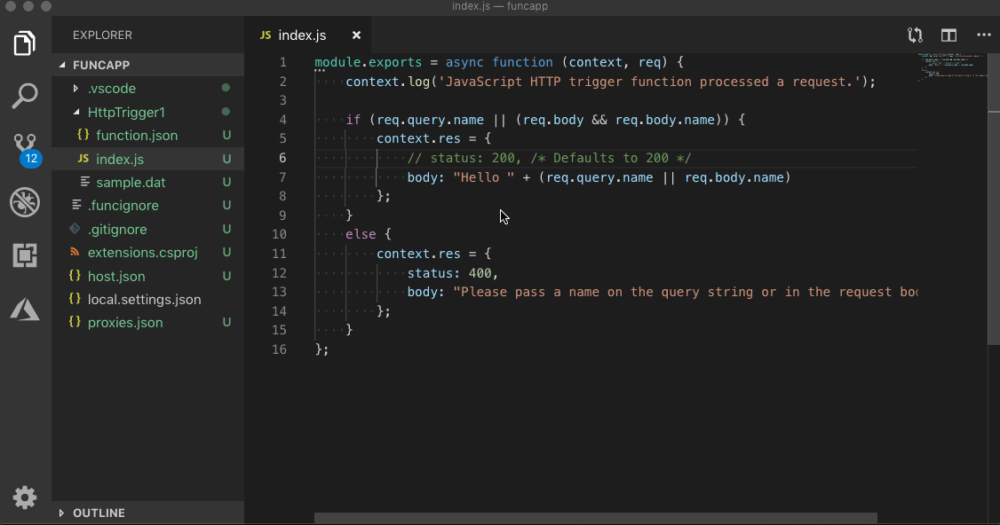
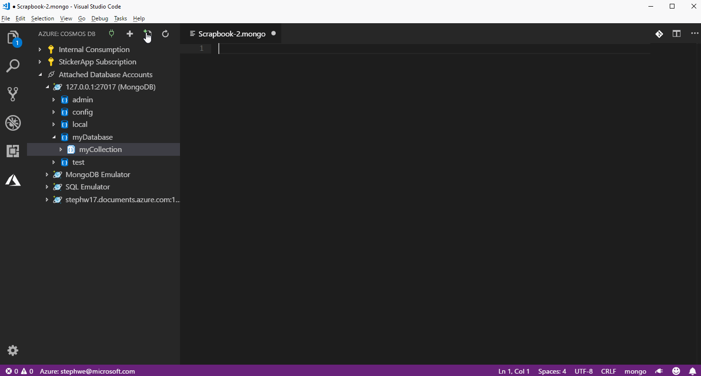
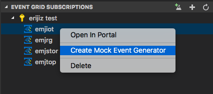
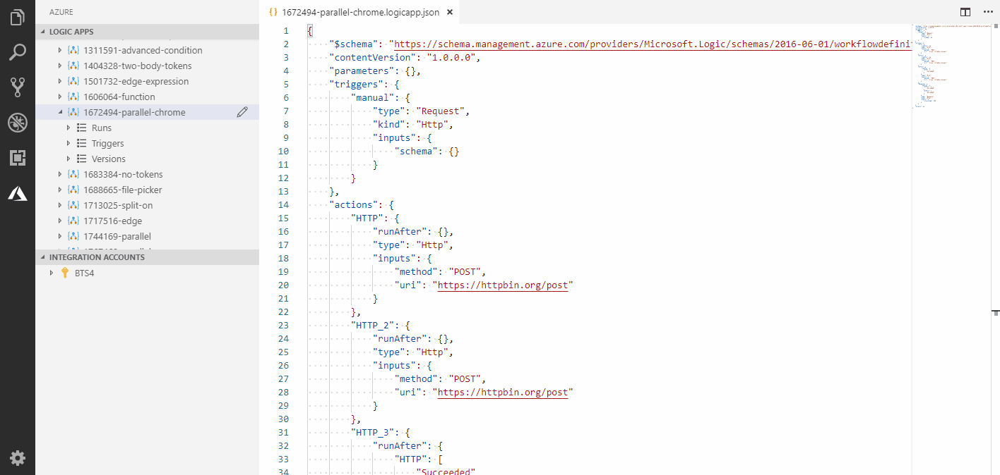
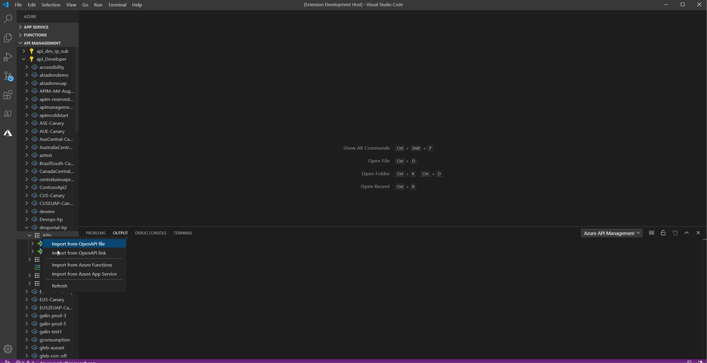

# Azure Serverless for Visual Studio Code

Everything you need to build and deploy [serverless](https://azure.microsoft.com/en-us/overview/serverless-computing/) or event driven apps in VS Code.

_If you do not have an Azure subscription, [sign up today](https://azure.microsoft.com/en-us/free/?b=16.48) for a free account. You'll get 12 months of popular free services, **\$200** in Azure Credits to try out any combination of Azure services, and access to 25+ always free services such as Azure Container Service, DevTest Labs, and Service Fabric._

## What's included

This extension pack covers everything from building serverless functions to configuring custom event topics and connecting to databases on Azure.

### [Azure Functions](https://marketplace.visualstudio.com/items?itemName=ms-azuretools.vscode-azurefunctions)

Create and build Azure Functions apps, debug them locally in VS Code, then deploy directly from your favorite editor.

### [Azure Databases](https://marketplace.visualstudio.com/items?itemName=ms-azuretools.vscode-cosmosdb)

Browse and query your MongoDB databases both locally and in the cloud using scrapbooks with rich Intellisense then connect to Azure to manage your PostgreSQL and Cosmos DB databases with support for MongoDB, Graph (Gremlin), and SQL (previously known as DocumentDB).

### [Azure Event Grid](https://marketplace.visualstudio.com/items?itemName=ms-azuretools.vscode-azureeventgrid)

Create and manage Azure Event Grid topics and subscriptions. Easily generate and send mock events to your subscriptions for rapid development.

### [Azure Logic Apps](https://marketplace.visualstudio.com/items?itemName=ms-azuretools.vscode-logicapps)

Quickly create, debug, and manage Azure Logic Apps and Integration Accounts directly from within VS Code.

## [Azure API Management](https://marketplace.visualstudio.com/items?itemName=ms-azuretools.vscode-apimanagement)

Perform common management operations on your Azure API Management service instances without switching away from Visual Studio Code.

**Happy coding!**

# Contributing

This project welcomes contributions and suggestions. Most contributions require you to agree to a
Contributor License Agreement (CLA) declaring that you have the right to, and actually do, grant us
the rights to use your contribution. For details, visit https://cla.opensource.microsoft.com.

When you submit a pull request, a CLA bot will automatically determine whether you need to provide
a CLA and decorate the PR appropriately (e.g., status check, comment). Simply follow the instructions
provided by the bot. You will only need to do this once across all repos using our CLA.

This project has adopted the [Microsoft Open Source Code of Conduct](https://opensource.microsoft.com/codeofconduct/).
For more information see the [Code of Conduct FAQ](https://opensource.microsoft.com/codeofconduct/faq/) or
contact [opencode@microsoft.com](mailto:opencode@microsoft.com) with any additional questions or comments.
